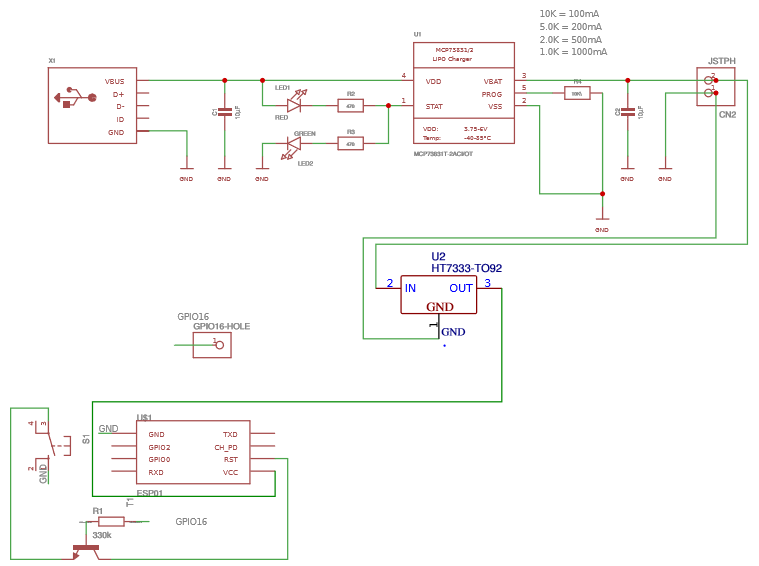

# ESPButton

This project is a clone of the AWS Dash Button. 

The idea of this project is that an ESP8266-01s sleeps until a button is pressed, when the button is pressed the ESP8266 does a certain action and goes back to sleep.

Keep in mind, this is all prototyping.

The circuit contains a Lipo battery charging circuit, as well as a NPN transistor to make sure the ESP can't be reset while it is operating.
GPIO16 is high when the ESP is in deepSleep, RESET needs to be connected to GND to wake up.

# Repo content
This repository contains the source code, written in Visual Studio Code with the Platformio extension. 

The PCB files are also included. As well as a initial 3D printed case design.

	